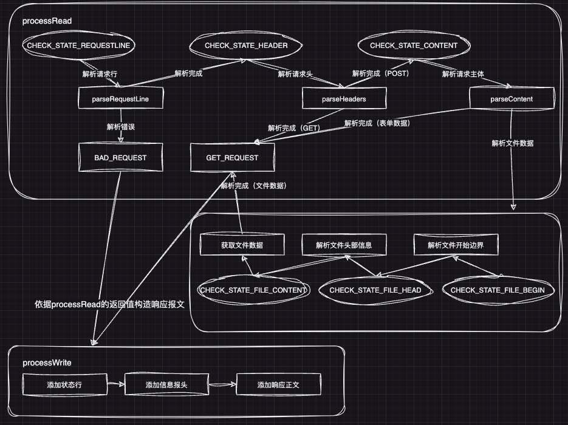
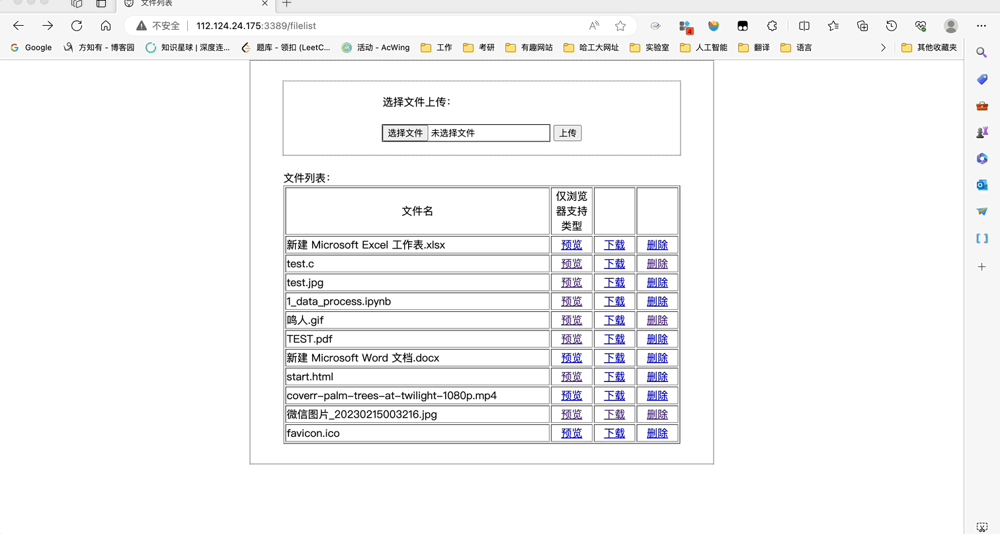
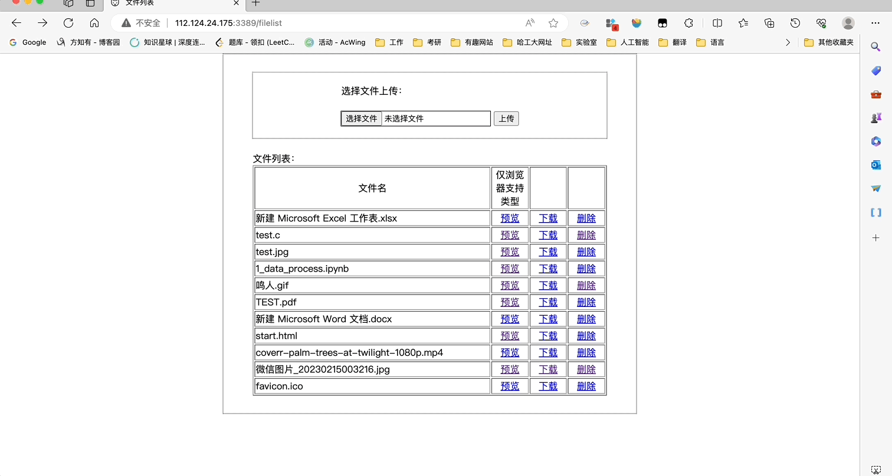
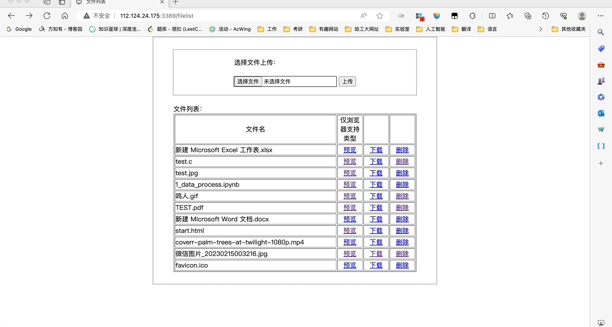

# WebStoreServer

本项目为C++编写的Web服务器，基本的网络框架参考了muduo。本项目首先实现了最基本的**网络库**，可以在网络库的基础上实现自己的**业务逻辑**，本项目在网络库的基础上实现了简单的**HTTP服务器**，可以进行**登录、文件存储、文件预览、文件下载与删除**等操作。主要功能如下：

1. 网络库部分：
   * 使用**线程池**、**EPOLL**、**非阻塞读写**、**边缘触发**实现高并发处理请求。
   * 使用**Reactor模型**，基本框架为**多Reactor多线程**，也即**muduo**中的**One loop per thread**：主线程中的**mainReactor**负责新连接的建立，收到事件通知后通过Accpetor对象建立新连接并分配给某个子线程，子线程中的**subReactor**对加入的新连接进行事件的监听并通过设置的回调函数进行处理。
   * **Channel类**与**EventLoop类**：channel对象相当于一个事件，其有设置好的对应事件的回调函数；EventLoop对象进行事件的监听，每个子线程调用其中的loop监听函数进行连接的读事件监听。
   * **缓冲区**：使用std::string作为缓冲区，存储TCP连接读写数据，准确获取客服端的数据大小。
   * **定时器**：使用std::priority_queue实现小根堆结构定时器管理，每次读写时依据消息大小进行时间的更新，并在每次操作后延长一定时间。同一事件源，将定时器信号添加到主线程的监听中，定时信号定时触发发事件，回调函数删除超时的非活动连接。
   * **日志**：异步日志系统记录服务器的运行状态。日志对象为单例模式，进行日志写的时候通过生产者-消费者模型和单独的线程进行记录。
2. HTTP服务器部分：
   * 支持**GET**、**POST**方法，使用**状态机**解析请求报文，依据解析结果进行响应报文的构造。
   * **GET**方法用于获取起始页面、文件列表、文件下载、文件删除、文件预览的请求，**POST**方法用于文件上传、注册与登录。
   * **Web端的功能**：用户注册与登录、文件上传、文件预览（仅浏览器支持的类型）、文件下载、文件删除。
   * 使用**数据库连接池**，降低反复频繁创建和断开数据库连接的开销。

## 目录

| [整体框架](#整体框架) | [环境要求](#环境要求) | [使用及功能展示](#使用及功能展示) | [致谢](#致谢) | [遇到的问题](https://github.com/gongshanchong/WebStoreServer/blob/main/%E9%81%87%E5%88%B0%E7%9A%84%E9%97%AE%E9%A2%98.md) |
| :----------------: | :----------------: | :----------------------------: | :--------: | :-------------------------------------------------------------------------------------------------------------------: |

## 整体框架




## 环境要求

本项目使用了智能指针，如std::make_unique，还有其他一些C++新特性，本项目的环境部署在阿里云，使用版本如下：

1. 服务端环境：

   * C++17及以上
   * mysql  Ver 8.0.34 for Linux on x86_64
   * CentOS Linux release 7.9.2009 (Core)
2. 浏览器（目前测试过的）：

   * Windows、Mac
   * Edge、Chrome、Safari
3. 已安装MySQL数据库并创建表格:

```
// 建立yourdb库
create database yourdb;
// 创建user表
USE yourdb;
CREATE TABLE user(
username char(50) NULL,
passwd char(50) NULL
)ENGINE=InnoDB;
// 添加数据
INSERT INTO user(username, passwd) VALUES('name', 'passwd');
```

## 使用及功能展示

1. 在待运行的系统上建立对应的数据库以及表格，然后修改main.cpp中对应的数据库的初始化信息。
2. 编译并运行代码：

   ```
   make
   ./server
   ```
3. 功能展示：

   1. 注册
      
   2. 登录
      
   3. 文件预览
      
   4. 文件预览、文件下载、文件删除
      
      

## 致谢

本项目实现过程中，参考了许多优秀的Github项目：

* TinyWebServer：[https://github.com/qinguoyi/TinyWebServer](https://github.com/qinguoyi/TinyWebServer)
* WebFileServer：[https://github.com/shangguanyongshi/WebFileServer](https://github.com/shangguanyongshi/WebFileServer)
* 30dayMakeCppServer：[https://github.com/yuesong-feng/30dayMakeCppServer](https://github.com/yuesong-feng/30dayMakeCppServer)

本人能力一般，项目实现时按照个人的想法实现的，本项目也暂时没有做测试，如果有不足的地方，希望和大家提出，多多交流，感谢！
